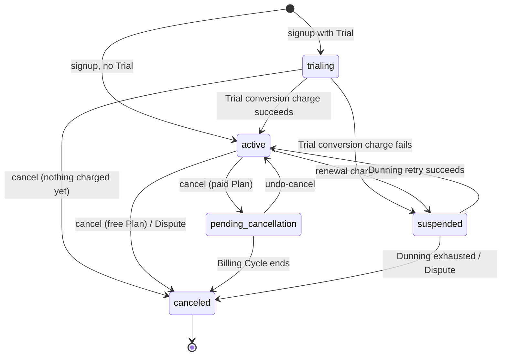

# Subscription Billing Engine

A B2C, single-currency, flat-rate recurring billing system built as a Spring Boot modular
monolith: subscribing customers to plans, running monthly charges, handling payment
failure (Dunning), gateway webhooks (disputes), invoicing/receipts, notifications, and an
append-only audit trail of every Subscription state transition.

## High-level design

Two clients — the customer-facing frontend and the Stripe webhook sender — talk to a
single Spring Boot API over HTTP. The API is a modular monolith: each module owns its
own domain rules, persistence, and data, and modules only ever talk to each other through
application interfaces, commands, domain events, or read models — never by reaching into
another module's tables directly. All modules share one PostgreSQL database, but table
ownership per module stays explicit.

```
                       +--------------------+
         Customer ---> |                    |
                       |   Frontend (SPA)   |
         Admin ------> |                    |
                       +----------+---------+
                                  | HTTPS, /api/v1, JWT bearer
                                  |
                                  v
                       +--------------------------------------------------------------+
         Stripe -----> |                          api module                          |
         (webhook)     |              REST controllers · ApiApplication               |
                       +--------+---------------+---------------+---------------+-----+
                                v               v               v               v
                          billing-core     billing-job       dunning        invoicing
                                |               |               |               |
                            payments        webhooks      notifications       audit
                                |                               |
                             Stripe                    Kafka outbox relay
                                |
                                v
     PostgreSQL (shared, one schema per module's ownership)
```

The daily billing job (`billing-job`) drives the recurring-charge flow: it finds due
Subscriptions, asks `billing-core` to advance them, and invokes `payments` to charge the
card. A failed charge hands off to `dunning`, which schedules retries; a Stripe dispute or
exhausted Dunning schedule cancels the Subscription. Every charge attempt produces an
`invoicing` record, every state transition is appended to `audit`, and customer-facing
events (receipts, dunning notices) are published to `notifications`' transactional outbox
for asynchronous delivery over Kafka. Inbound Stripe webhooks land in `webhooks`, which
verifies signatures, dedupes, and dispatches into the relevant module.

## Architecture

A modular monolith: modules are organized around business capabilities, each owning its
own domain rules, persistence model, and data — no cross-module JPA entities or database
joins. Modules communicate through application interfaces, commands, domain events, or
read models, never by reaching into another module's repositories directly.

| Module | Owns |
|---|---|
| [`billing-core`](backend/billing-core) | Subscription/Plan/PriceVersion domain model, persistence, and idempotency infrastructure |
| [`billing-job`](backend/billing-job) | Daily batch billing job: due-subscription scanning and Anchor Date advancement |
| [`dunning`](backend/dunning) | Failed-charge hand-off policy for the bounded Dunning retry schedule |
| [`invoicing`](backend/invoicing) | Invoice/PaymentAttempt schema, entities, and PDF receipts |
| [`payments`](backend/payments) | `PaymentGatewayClient` contract and the Stripe test-mode integration |
| [`webhooks`](backend/webhooks) | Inbound gateway webhook ingestion: signature verification, dedupe, dispatch |
| [`notifications`](backend/notifications) | Transactional-outbox-backed customer notifications |
| [`audit`](backend/audit) | Append-only `AuditLogEntry` record of every Subscription state transition |
| [`api`](backend/api) | REST controllers and the runnable Spring Boot application |

Each module is its own Maven artifact under [`backend/`](backend), aggregated by
[`backend/pom.xml`](backend/pom.xml). `api` is the only module that wires every other
module's port implementations together, so it's also where the runnable application and
the full-stack integration tests live.

## Database design

```
┌──────────────────┐  1      N  ┌─────────────────────────┐  N      1  ┌───────────────────────┐  1      N  ┌───────────────────┐
│     Customer     │────────────│       Subscription      │────────────│          Plan         │────────────│    PriceVersion   │
├──────────────────┤            ├─────────────────────────┤            ├───────────────────────┤            ├───────────────────┤
│ PK id            │            │ PK id                   │            │ PK id                 │            │ PK id             │
│    email UK      │            │ FK customer_id          │            │    code UK            │            │ FK plan_id        │
│    password_hash │            │ FK plan_id              │            │    name               │            │    amount         │
│    created_at    │            │ FK pending_plan_id      │            │    retired_for_signup │            │    effective_from │
└───┬─────────┬────┘            │    state                │            └───────────────────────┘            └─────────┬─────────┘
    ┊         ┊                 │    billing_cycle_anchor │                                                           ┊
    ┊         ┊                 │    due_date             │                                                           ┊
    ┊         ┊                 │    version              │                                                           ┊
    ┊         ┊                 └─────┬──────────────┬────┘                                                           ┊
    ┊         ┊                       ┊              ┊                                                                ┊
    ┊         └╌╌╌╌╌╌╌╌╌╌╌╌╌╌╌╌╌╌╌╌╌╌╌┊╌╌╌╌╌┐        ┊                                                                ┊
    ┊                                 ┊     ┊        ┊                                                                ┊
    └╌╌╌╌╌╌┐                          ┊     ┊        ┊                                                                ┊
           ┊                          ┊     ┊        ┊                                                                ┊
           ┊                          └╌╌╌╌╌╌╌╌╌╌╌╌╌╌┊╌╌╌╌╌╌╌╌╌╌╌╌╌╌╌╌╌╌╌╌╌╌╌╌┐                                       ┊
           ┊                                ┊        ┊                        ┊                                       ┊
           ┊                                ┊        └╌╌╌╌╌╌╌╌╌╌╌╌╌╌╌╌╌╌╌╌╌╌╌╌╌╌╌╌╌╌╌╌╌╌╌╌╌╌╌╌╌╌╌╌╌╌╌╌╌╌╌╌┬╌╌╌╌╌╌╌╌╌╌╌┘
           ┊                                ┊                                 ┊                           ┊
           ┊                                ┊                                 ┊                           ┊
┌──────────▼─────────┐      ┌───────────────▼───────────────┐      ┌──────────▼─────────┐      ┌──────────▼──────────┐
│   IdempotencyKey   │      │         PaymentMethod         │      │   AuditLogEntry    │      │       Invoice       │
├────────────────────┤      ├───────────────────────────────┤      ├────────────────────┤      ├─────────────────────┤
│ PK id              │      │ PK id                         │      │ PK id              │      │ PK id               │
│    customer_id     │      │    customer_id                │      │    subscription_id │      │    subscription_id  │
│    operation       │      │    provider                   │      │    actor_type      │      │    price_version_id │
│    idempotency_key │      │    provider_payment_method_id │      │    old_state       │      │    billing_period   │
└────────────────────┘      │    last4                      │      │    new_state       │      │    status           │
                            └───────────────────────────────┘      └────────────────────┘      │    retries_used     │
                                                                                               └────┬───────────┬────┘
                                                                                                    │           │
                                                                                                    └──────┐    └────────────────────────┐
                                                                                                           │                             │
                                                                                                           │                             │
                                                                                                           │                             │
                                                                                                           │                             │
                                      ┌─────────────────┐      ┌────────────────────────┐      ┌───────────▼──────────┐        ┌─────────▼────────┐
                                      │   OutboxEvent   │      │      WebhookEvent      │      │    PaymentAttempt    │        │     Receipt      │
                                      ├─────────────────┤      ├────────────────────────┤      ├──────────────────────┤        ├──────────────────┤
                                      │ PK id           │      │ PK id                  │      │ PK id                │        │ PK id            │
                                      │    event_type   │      │    gateway_event_id UK │      │ FK invoice_id        │        │ FK invoice_id UK │
                                      │    payload      │      │    received_at         │      │    status            │        │    pdf           │
                                      │    published_at │      └────────────────────────┘      │    gateway_reference │        └──────────────────┘
                                      └─────────────────┘                                      └──────────────────────┘
```

## Tech stack

Java 21, Spring Boot 4, PostgreSQL (Flyway migrations), Kafka + Avro (Apicurio schema
registry) for the notifications outbox relay, Redis, Stripe (test mode) as the v1 payment
gateway, JWT bearer auth, Prometheus + Grafana for observability, Testcontainers for
integration tests.

## Running locally

Prerequisites: JDK 21+, Maven, Docker.

Start local infrastructure (Postgres, Kafka, schema registry, Redis, Prometheus, Grafana):

```
docker-compose up -d
```

Run the API:

```
cd backend
mvn -pl api -am install -DskipTests
mvn -pl api spring-boot:run
```

The API listens on `http://localhost:8080` (override with `SERVER_PORT`). Prometheus
scrapes `/actuator/prometheus`; Grafana is at `http://localhost:3001` (admin/admin).

Admin sign-in is via Auth0, which is SaaS-only — there's no bundled docker-compose
service for it. Short version setup: create a free Auth0 Developer org, register a native/SPA OIDC application
(Authorization Code + PKCE, no client secret, redirect URI
`http://localhost:5173/admin/sso-callback`), register a custom API, and add a Post-Login
Action populating namespaced `groups`/`preferred_username` claims — then set
`ADMIN_SSO_ISSUER_URI`/`ADMIN_SSO_ROLE`/`ADMIN_SSO_CLAIM_NAMESPACE` (backend) and
`VITE_ADMIN_SSO_ISSUER_URI`/`VITE_ADMIN_SSO_CLIENT_ID`/`VITE_ADMIN_SSO_AUDIENCE`/
`VITE_ADMIN_SSO_CLAIM_NAMESPACE` to that org's values.

Run the daily billing job manually (requires local infra already running):

```
make billing-job
```

In production this same entry point (`ApiApplication --job=billing-run`) is invoked by
the Kubernetes CronJob in [`k8s/billing-job-cronjob.yaml`](k8s/billing-job-cronjob.yaml).

### Configuration

`backend/api/.env`:

```
# --- Database (defaults already match docker-compose; only override for a
# non-default Postgres) ---
DB_HOST=localhost
DB_PORT=5432
DB_NAME=subscription_billing
DB_USERNAME=subscription_billing
DB_PASSWORD=subscription_billing

# --- Kafka / Apicurio schema registry (outbox relay) ---
KAFKA_BOOTSTRAP_SERVERS=localhost:9092
SCHEMA_REGISTRY_URL=http://localhost:8081/apis/registry/v3

# --- Customer JWT signing secret ---
JWT_SECRET=replace-with-a-long-random-secret

# --- Admin SSO (Auth0) -- SaaS-only, no working default; required even for local dev ---
ADMIN_SSO_ISSUER_URI=https://{yourTenant}.auth0.com/
ADMIN_SSO_ROLE=admin
ADMIN_SSO_CLAIM_NAMESPACE=https://api.subscription-billing.local

# --- Stripe (test mode) ---
STRIPE_API_KEY=sk_test_your_stripe_test_secret_key
STRIPE_WEBHOOK_SECRET=whsec_your_stripe_webhook_signing_secret

# --- CORS (defaults already match the local Vite dev server) ---
CORS_ALLOWED_ORIGINS=http://localhost:5173
CORS_ALLOWED_METHODS=GET,POST,OPTIONS
CORS_ALLOWED_HEADERS=Authorization,Content-Type,Idempotency-Key

# --- Misc ---
SERVER_PORT=8080
OUTBOX_RELAY_POLL_INTERVAL_MS=5000
```

## API

All endpoints are versioned under `/api/v1`. Bearer-token auth (JWT) is required except
for signup and the gateway webhook receiver.

| Method | Path | Purpose |
|---|---|---|
| `GET` | `/api/v1/plans` | List the plan catalog |
| `POST` | `/api/v1/subscriptions` | Sign up (free, Trial, or immediate-paid) |
| `GET` | `/api/v1/subscriptions/{id}` | Fetch the caller's own Subscription |
| `POST` | `/api/v1/subscriptions/{id}/cancel` | Cancel (immediate or deferred, per originating state) |
| `POST` | `/api/v1/subscriptions/{id}/undo-cancel` | Reverse a pending cancellation |
| `POST` | `/api/v1/subscriptions/{id}/plan-change` | Schedule or apply a plan change |
| `POST` | `/api/v1/subscriptions/{id}/retry-payment` | Self-service Dunning retry while `suspended` |
| `GET` | `/api/v1/subscriptions/{id}/invoices` | List a Subscription's invoices |
| `GET` | `/api/v1/invoices/{id}` | Fetch an invoice |
| `GET` | `/api/v1/invoices/{id}/receipt` | Download an invoice's PDF receipt |
| `POST` | `/api/v1/webhooks/gateway` | Inbound Stripe webhook receiver |

## Subscription lifecycle

A Subscription is in exactly one of five states; every transition is appended to
`audit`'s `AuditLogEntry` log.



## Frontend

A single Vite SPA under [`frontend/`](frontend) serving two separate portals off one
router (`AppRoutes`/`AdminRoutes`):

- **Customer portal** (`/`) — plan browsing, signup, the subscription dashboard, and
  invoice history/receipts.
- **Admin portal** (`/admin/*`) — read-only Customer/Subscription/Invoice lookup plus
  Plan catalog management (create, retire, add price versions).

The two portals are independent personas, not roles on one account: each has its own
login, its own JWT held in its own session store (`sessionStore` vs `adminSessionStore`),
and neither can act on the other's behalf. Customer login is email/password against this
service itself; Admin sign-in is SSO via Auth0
— the SPA redirects to Auth0 directly (Authorization Code + PKCE) and this backend only
ever validates the
resulting token, never issues one itself. [`frontend/src/api/client.ts`](frontend/src/api/client.ts)
picks which store to attach a bearer token from per-request, based on whether the request
targets `/api/v1/admin/*`.

Stack: React 19, TypeScript, MUI, React Router, TanStack Query for server state, React
Hook Form + Zod for forms/validation, Recharts for the admin overview charts.
**API client**: OpenAPI is the source of truth. The backend's OpenAPI spec is synced
locally (`npm run sync:api-spec`) and turned into a typed schema (`npm run generate:api`)
consumed via `openapi-fetch`/`openapi-react-query` — no hand-written API types.

Structure:

```
frontend/src/
├── api/          generated OpenAPI schema + typed client, error mapping
├── auth/         per-persona session stores and auth contexts
├── components/   shared layout/loading/empty/error UI
├── features/     one folder per screen area (admin/*, invoices, plans, subscription)
├── routes/       AppRoutes (customer) + AdminRoutes, route guards
└── schemas/      Zod schemas for form validation
```

`frontend/.env`:

```
# --- API base URL the SPA calls (defaults to http://localhost:8080 if unset) ---
VITE_API_BASE_URL=http://localhost:8080

# --- Admin SSO (Auth0) -- must point at the same tenant/app as the backend's
# ADMIN_SSO_* variables above ---
VITE_ADMIN_SSO_ISSUER_URI=https://{yourTenant}.auth0.com
VITE_ADMIN_SSO_CLIENT_ID=your-auth0-native-spa-client-id
VITE_ADMIN_SSO_AUDIENCE=https://api.subscription-billing.local
VITE_ADMIN_SSO_CLAIM_NAMESPACE=https://api.subscription-billing.local

# --- Stripe (test mode, publishable key only -- safe to ship to the browser, but
# must match the Stripe account backend's STRIPE_API_KEY points at) ---
VITE_STRIPE_PUBLISHABLE_KEY=pk_test_your_stripe_test_publishable_key
```

Running locally:

```
cd frontend
npm install
npm run dev          # http://localhost:5173, proxies to the API at VITE_API_BASE_URL
```

Testing:

```
npm run test          # Vitest + React Testing Library (unit/component)
npm run test:e2e       # Playwright, critical flows: signup, admin flow
npm run typecheck
npm run lint
```

## Testing

```
cd backend
mvn -pl api -am test     # unit tests
mvn -pl api -am verify   # unit + Testcontainers-backed integration tests (needs Docker)
```
