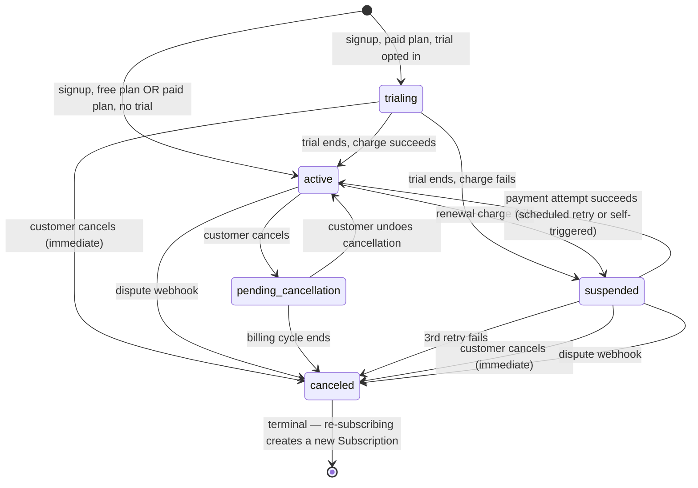

# Subscription Billing Engine — Domain Model

Derived from [`docs/product/prd.md`](../product/prd.md), [`docs/design/product-design.md`](../design/product-design.md), and [`CONTEXT.md`](../../CONTEXT.md). Entities, value objects, relationships, invariants, and state transitions only — no implementation.

## Entities

Things with identity that persist and change over time.

### Customer
Owns Subscriptions over its lifetime (never more than one non-`canceled` at a time — see Invariant 1). Holds the card-on-file reference used for auto-charging.

### Subscription
The central entity. Ties a Customer to a Plan and carries the lifecycle state. Attributes worth naming explicitly:
- `state` (see State Transitions below)
- `plan` — the current Plan
- `pendingPlanChange` — optional; at most one (Invariant 4)
- `billingCycle` — present only once on a paid Plan (Invariant 5)
- `trialUsed` — whether this Subscription instance ever ran a Trial (a new Subscription after re-subscribing starts fresh)

### Plan
A named, priced offering. Immutable once a price is in effect — a price *change* creates a new `Price Version` rather than mutating the existing price (Invariant 9). Carries a `retiredForSignup` flag distinct from being referenced by existing Subscriptions (Invariant 10).

### Price Version
One effective-dated price in a Plan's history. Needs its own identity and effective-from date so an Invoice can snapshot which version it charged, independent of the Plan's current price.

### Invoice
One per Billing Cycle (Invariant 6). Snapshots the price actually charged, independent of the Plan's current price. Reaches a terminal status of `paid` or `failed` once its Payment Attempts are exhausted or one succeeds.

### PaymentAttempt
One try at charging the card against an Invoice. 1 on the happy path, up to 4 under Dunning (initial + 3 retries). Each attempt is either scheduled (Dunning) or customer-triggered (self-service retry while `suspended`).

### AuditLogEntry
Append-only record of a Subscription state transition: who/what/when/old value/new value. Never mutated or deleted (Invariant 12).

## Value objects

Things defined entirely by their value, with no identity of their own.

- **Money** — a `BigDecimal` amount. No currency field on the value object itself since the system is single-currency by decision; currency is a global constant, not a per-instance concern.
- **AnchorDate** — a day-of-month plus the last-valid-day clamping rule (Jan 31 → Feb 28/29 → Mar 31...).
- **Billing Cycle** — the recurring monthly period itself (start date + Anchor Date). Also doubles as the second half of an Invoice's natural key: `(subscription, billing cycle)` is what ADR-0001's `subscription_id + billing_period` column pairing implements — "billing_period" there is just the DB column name for this same concept, not a distinct one.
- **DunningSchedule** — the fixed retry offsets (day 1, day 3, day 7) after an initial failure.
- **WebhookEventId** — the gateway's unique event identifier, used as the dedupe key for webhook idempotency.

## Relationships

```
Customer 1 ──── 0..* Subscription        (sequential, not concurrent — Invariant 1)
Subscription *──── 1 Plan                (current plan)
Subscription 0..1 ──── 1 Plan            (pending plan change target)
Plan 1 ──── * Price Version           (price history)
Subscription 1 ──── 0..* Invoice         (one per Billing Cycle; zero while free — Invariant 5)
Invoice 1 ──── 1..4 PaymentAttempt
Subscription 1 ──── * AuditLogEntry
```

## State transitions



Plan changes (upgrade/downgrade/free-toggle) are not shown above because they don't change `state` — they mutate `pendingPlanChange` (applied at the next Billing Cycle) or, for free→paid, apply immediately without a state transition of their own.

## Invariants

Rules that must hold at all times, regardless of code path.

1. **A Customer has at most one non-`canceled` Subscription at a time.** Multiple Subscriptions over a lifetime are fine (re-subscribing after cancellation); concurrent ones are not.
2. **A Subscription references exactly one Plan at any instant.** No dual-plan states, even mid-transition.
3. **All monetary values are `BigDecimal`.** Never floating point, per CLAUDE.md.
4. **A Subscription holds at most one pending plan change.** Setting a new one overwrites the old one atomically.
5. **A Subscription has a Billing Cycle / Anchor Date only while on a paid Plan.** A free Subscription has neither, and therefore produces zero Invoices.
6. **`(subscription_id, billing_period)` is unique.** Exactly one Invoice can exist per Subscription per Billing Cycle — this is what makes the daily batch job idempotent under crash/retry/duplicate execution (ADR-0001).
7. **`canceled` is terminal.** No transition leaves `canceled`; a Customer who wants back in gets a brand-new Subscription, not a reactivated one.
8. **`pending_cancellation` is reachable only from `active`.** Cancellation from `trialing` or `suspended` goes straight to `canceled` — there's no currently-active paid access to defer the loss of.
9. **A Plan's price change never retroactively alters an issued Invoice.** Each Invoice snapshots the `Price Version` in effect when it was charged.
10. **A retired Plan (`retiredForSignup`) remains valid for existing Subscriptions but cannot be selected by a new signup or plan change.**
11. **Dunning retries are bounded at 3.** No unbounded or indefinite retry loop, per CLAUDE.md's bounded-retry rule.
12. **Every Subscription state transition produces exactly one AuditLogEntry**, and AuditLogEntries are immutable once written.
13. **Webhook processing is idempotent by `WebhookEventId`.** A redelivered event with a previously-seen ID is a no-op, not a re-application.

## Business rules

Policies that shape behavior but aren't structural invariants — these are more likely to change than the invariants above.

- **Dunning schedule**: retry on day 1, day 3, day 7 after the initial failure; cancel if the day-7 retry also fails.
- **Anchor Date clamping**: a Billing Cycle starting on a day that doesn't exist in a shorter month clamps to that month's last day (Jan 31 → Feb 28/29), then reverts to the original day-of-month once it exists again.
- **Plan price migration**: existing Subscriptions move to a new `Price Version` at their *next* Billing Cycle, never mid-cycle.
- **Free→paid upgrade**: applies immediately (charge now, new Billing Cycle anchored to today) — the one case where a plan change doesn't wait for "next cycle."
- **Self-service payment retry**: a `suspended` Subscription may have a Payment Attempt triggered by the customer (after updating their card) in addition to the 3 scheduled Dunning attempts — this doesn't reset or extend the Dunning schedule, it just gives an early chance at one of the existing attempts.
- **Notification triggers**: successful charge, failed charge, trial-ending-soon, and cancellation-confirmed are the only events that notify the customer (no notification on plan-change-scheduled, dispute, or self-service retry, per current scope).
- **Missed billing-run recovery**: the due-subscriptions query is `due_date <= today`, not `== today` — a skipped run is caught up automatically by the next one, no separate backfill.
